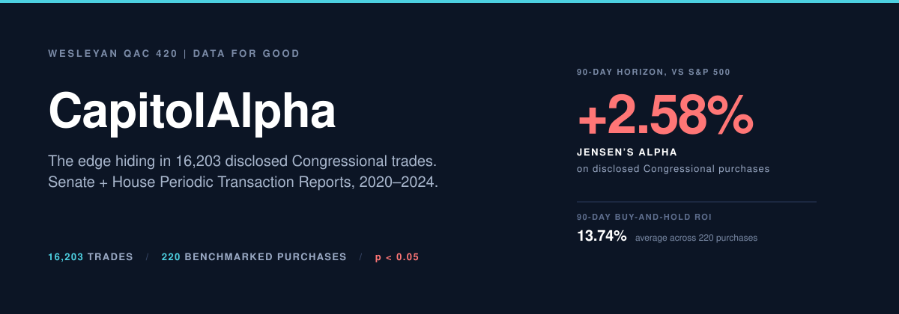
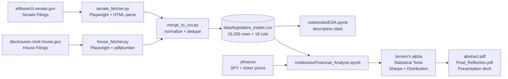

<picture>
  <source media="(prefers-color-scheme: dark)"  srcset="assets/banner-dark.svg"  type="image/svg+xml">
  <source media="(prefers-color-scheme: light)" srcset="assets/banner-light.svg" type="image/svg+xml">
  <source media="(prefers-color-scheme: dark)"  srcset="assets/banner-dark.png">
  <source media="(prefers-color-scheme: light)" srcset="assets/banner-light.png">
  
</picture>

[](https://github.com/Builder106/capitol-alpha/actions/workflows/ci.yml)
[](https://capitolalpha.vercel.app)
[](https://www.python.org/)
[](https://playwright.dev/python/)
[](#license)
[](https://www.wesleyan.edu/qac/)

> **Analyzing whether Congressional stock trades beat the market.** An open research pipeline tracking 16,000 politician stock disclosures against the S&P 500.

## 💡 What is CapitolAlpha?

Do members of Congress make better stock market trades than ordinary investors? CapitolAlpha is an open data pipeline that automatically collects and analyzes over 16,000 stock trades reported by federal politicians. It compares their financial returns against the general stock market (S&P 500) to determine whether politicians have an abnormal trading advantage.

Members of Congress disclosed **16,203 stock trades** between 2020 and 2024. Their *purchases* beat the S&P 500 by an average of **+2.58%** over the following 90 days (statistically significant at p < 0.05). This repository contains the end-to-end pipeline behind that finding.

**Findings page:** [capitolalpha.vercel.app](https://capitolalpha.vercel.app) (the headline statistics, interactive charts, and formal writeup in one place).

## 🛠 Project Overview

A semester project for **QAC 420 (Data for Good)** at Wesleyan University using public data for civic accountability.

The answer is a reproducible Python pipeline that:

1. Scrapes Senate stock disclosure reports (Periodic Transaction Reports) directly from **efdsearch.senate.gov** using automated browser scripts.
2. Extracts House disclosure PDFs from **disclosures-clerk.house.gov** via table extraction tools.
3. Normalizes filings from both chambers into a single unified dataset (`legislative_trades.csv` with 16,203 rows across 2020 to 2024).
4. Pulls historical market prices via Yahoo Finance and calculates risk-adjusted excess returns (Jensen's alpha) over 30, 90, and 180-day holding periods compared to the S&P 500.

Full deliverables:

- **[Abstract](docs/abstract/abstract.pdf)**: 1-page academic abstract.
- **[Final Reflection](docs/Final_Reflection/Final_Reflection.pdf)**: 5-page essay on methodology, ethics, and future research.
- **[Statistics writeup](docs/statistics/statistics.pdf)**: Formal statistical workup behind the market-outperformance findings.

## Key findings

| Metric | Congressional purchases | S&P 500 (market benchmark) | Effect |
| --- | --- | --- | --- |
| Average 90-day return on investment | **13.74%** | ~11.16% | +2.58 percentage points |
| **Risk-adjusted excess return (Jensen's alpha)** | — | — | **+2.58%** (statistically significant, p < 0.05) |
| Pre-crash sell concentration | Top **5%** of sellers timed market exits before Feb 20, 2020 | — | Suggestive of timing, not definitive proof of cause |
| Analyzed trades | **220 benchmarkable purchases** out of 16,203 raw rows | — | Strict criteria requiring clear public ticker symbols |
| Time window | 2020-01-01 to 2024-12-31 | — | Spans the COVID-19 market drop and recovery |

*Note on terms:* **Jensen's alpha** measures how much an investment outperformed what would normally be expected given its market risk. A positive value (+2.58%) indicates that politician purchases gained more than expected compared to the general stock market.

The statistical details (t-statistics, confidence intervals, risk-adjusted Sharpe ratios, and return distributions) are available in [`notebooks/Financial_Analysis.ipynb`](notebooks/Financial_Analysis.ipynb).

## Pipeline



[`run_pipeline.py`](run_pipeline.py) orchestrates data extraction; individual modules live in [`pipeline/`](pipeline/). Automated tests for data extractors and data cleaning are in [`tests/`](tests/).

## Reproducing the analysis

```bash
# 1. Setup environment
uv sync --group dev
uv run playwright install chromium

# 2. Fetch data (Option A: scrape official sites)
python -m pipeline.run_pipeline --use-official

# 2b. (Option B: pre-aggregated dataset fallback)
python -m pipeline.run_pipeline

# 3. Run test suite
pytest

# 4. Open the analysis notebooks
jupyter lab notebooks/Financial_Analysis.ipynb
```

Pipeline options (`--fresh`, `--senate-only`, `--house-only`) and fallback settings are documented in [`pipeline/README_PIPELINE.md`](pipeline/README_PIPELINE.md).

## Research caveats

This is an academic study based on public filings. The findings are best read as an exploratory investigation:

- **Filing delay:** Politicians can disclose trades up to 30 to 45 days after they happen, meaning the public cannot copy these trades in real time.
- **Sample selection:** Only 220 trades out of 16,203 had clear stock ticker symbols and reliable price data across the analysis window. Private investments, real estate, and derivatives were excluded.
- **Statistical assumptions:** The risk adjustment model assumes standard market pricing models, which may vary during volatile periods like the early COVID pandemic.
- **Correlation vs. causation:** Beating the market can happen for multiple reasons, including personal wealth advisors, sector choices, or general market trends. The data shows correlation, not proof of insider knowledge.

The [Final Reflection PDF](docs/Final_Reflection/Final_Reflection.pdf) expands on all of these.

## Tech stack

- **Python 3.11+** with `pandas`, `scipy`, `matplotlib`, `seaborn`
- **Playwright** for browser automation on JavaScript-rendered disclosure sites
- **pdfplumber** for House PTR PDF table extraction
- **yfinance** for SPY and per-ticker price history
- **pytest** for unit tests on the fetchers and merge step
- **Jupyter** for the EDA and financial-analysis notebooks
- **Flourish** for the presentation visualization

## Acknowledgments

- The **Wesleyan QAC** for the *Data for Good* course frame and the methodological feedback through the semester.
- [`timothycarambat/senate-stock-watcher-data`](https://github.com/timothycarambat/senate-stock-watcher-data) as the JSON fallback when official scraping fails.
- The U.S. Senate Office of Public Records and the Office of the Clerk of the House for publishing the disclosure data that makes this analysis possible at all.

## License

Code released under the [MIT License](LICENSE). The underlying disclosure filings are public records in the public domain; the dataset assembled here (`data/legislative_trades.csv`) is released under the same terms.
